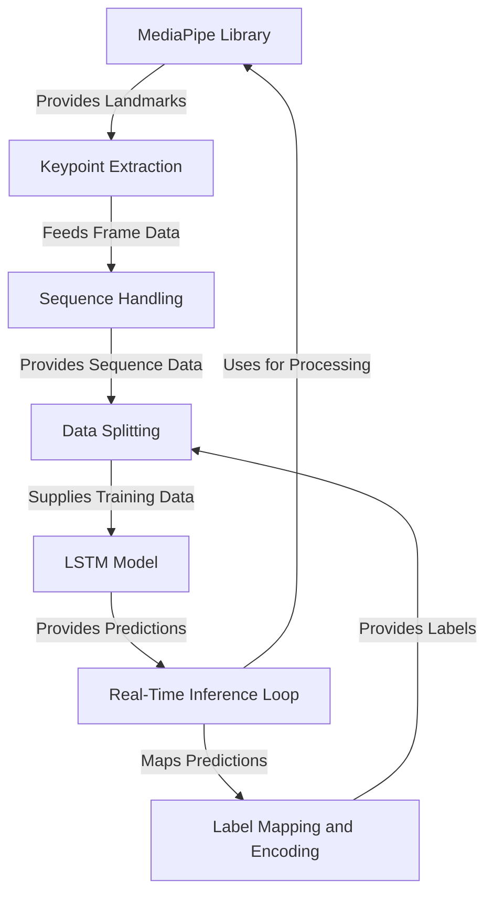

# Tutorial: RealTime_HandSign_Detection_LSTM

This project creates a real-time hand sign detection system. It **leverages the MediaPipe library** to *extract detailed key points* representing hand, face, and pose movements from video frames. These key points are then *structured into fixed-length sequences* that capture the temporal nature of gestures. A **Long Short-Term Memory (LSTM) neural network** is *trained* on this sequence data to predict the performed hand sign. The system culminates in a **real-time inference loop** that processes live camera feed, performs detection and prediction, and *visualizes the results* directly onto the video stream.

## Visual Overview

## Chapters

1. [MediaPipe Library
](01_mediapipe_library_.md)
2. [Keypoint Extraction
](02_keypoint_extraction_.md)
3. [Sequence Handling
](03_sequence_handling_.md)
4. [Label Mapping and Encoding
](04_label_mapping_and_encoding_.md)
5. [Data Splitting
](05_data_splitting_.md)
6. [LSTM Model
](06_lstm_model_.md)
7. [Real-Time Inference Loop
](07_real_time_inference_loop_.md)

---

Generated by [AI Codebase Knowledge Builder](https://github.com/The-Pocket/Tutorial-Codebase-Knowledge).
