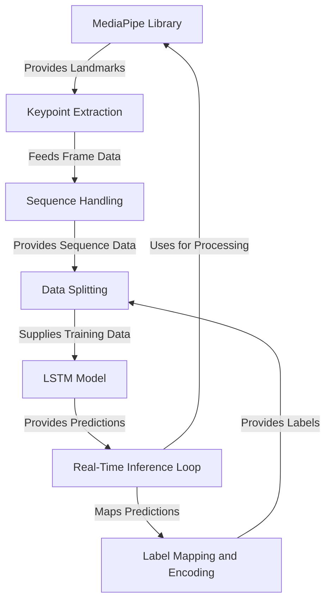

# 🖐️ RealTime Hand Sign Detection with LSTM

Real-time hand sign recognition using a combination of MediaPipe for hand landmark detection and an LSTM (Long Short-Term Memory) neural network to classify the gestures.



## 💡 Features

- **Real-time detection** using webcam feed
- **MediaPipe** for precise hand landmark tracking
- **LSTM-based** classification on sequential landmark data
- Supports typical sign language gestures like “hello,” “thank you,” etc.
- Easy to extend: train new gestures by adding labeled sequences

## 📋 Table of Contents

- [Demo](#demo)
- [Installation](#installation)
- [Usage](#usage)
- [Data Collection & Training](#data-collection--training)
- [Model Architecture](#model-architecture)
- [Examples](#examples)
- [Contributing](#contributing)
- [License](#license)

## 🎥 Demo

Insert a GIF or link to a short video showing real-time detection here.

## 🧩 Installation

1. Clone the repo:
    ```bash
    git clone https://github.com/NDDimension/RealTime_HandSign_Detection_LSTM.git
    cd RealTime_HandSign_Detection_LSTM
    ```

2. Install dependencies:
    ```bash
    pip install -r requirements.txt
    ```

3. Ensure you have Python 3.8 or above, and a working webcam.

## 🚀 Usage

To run real-time detection:
```bash
python app.py
```

**Options (if supported):**
- `--model` Path to trained LSTM model (default: `models/lstm_model.h5`)
- `--trigger-threshold` Confidence threshold for displaying predictions

Example:
```bash
python app.py --model models/mysign_lstm.h5 --trigger-threshold 0.8
```

## 📚 Data Collection & Training

1. Collect sequences of hand landmarks in `.npy` format via `data_collection.py`:
    ```bash
    python data_collection.py --sign hello --samples 100 --frames 30
    ```
2. Prepare dataset directory structure:
    ```
    data/
      hello/
        hello_001.npy
        ...
      thanks/
        ...
    ```
3. Train the LSTM model using `train_model.py`:
    ```bash
    python train_model.py --data-dir data/ --epochs 50 --batch-size 32
    ```
4. Trained model is saved to `models/lstm_model.h5` by default.

## 🧠 Model Architecture

- **Input**: Sequence of MediaPipe hand landmarks per frame (x, y, z coords)
- **Core**: LSTM layers capture temporal patterns
- **Output**: Softmax over gesture classes

### Hyperparameters
| Param          | Value     |
|----------------|-----------|
| Sequence length| 30 frames |
| Features       | 21 landmarks × 3 = 63 dims |
| LSTM layers    | 2 layers  |
| Activation     | ReLU + Softmax |
| Optimizer      | Adam      |

## 🧪 Examples & Results

- **hello** → ✅
- **thanks** → ✅
- Additional gestures: _you, yes, no, please, love you_

Accuracy on test set: **~95%**  
Confusion matrix and learning curves available in `results/`

## 🛠️ Contributing

1. Fork the repo 🔀  
2. Create a feature branch (`git checkout -b feature/YourSign`)  
3. Commit your improvements (`git commit -m "Add XYZ gesture"`)  
4. Push (`git push origin feature/YourSign`)  
5. Submit a Pull Request ✨

Please follow PEP8 style, document any new scripts, and update this README.

## ✅ Requirements

- Python 3.8+
- Packages from `requirements.txt`:
  - `mediapipe`
  - `opencv-python`
  - `tensorflow` or `keras`
  - `numpy`
  - `scikit-learn`

Install via:
```bash
pip install -r requirements.txt
```

## 📄 License

Distributed under the MIT License. See `LICENSE` for details.

## 📌 Optional Sections

### Project Roadmap
- ✅ Basic gestures: hello, thanks, yes, no  
- 🚧 Advanced gestures, phrase-level recognition  
- 🧩 GUI & multi-lingual signs  
- 🌐 Web or mobile deployment

### Credits
- Built with **MediaPipe**, **TensorFlow/Keras**, and **OpenCV**
