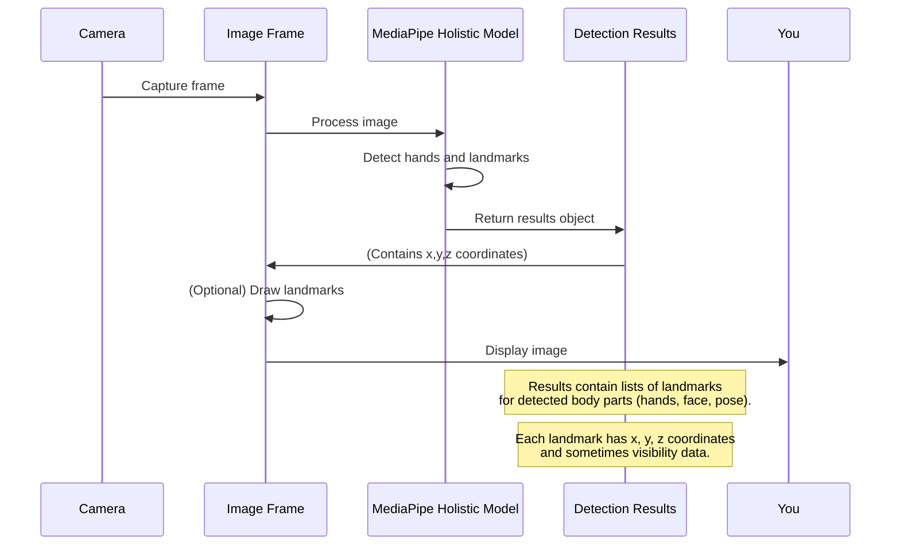

# 📘 Chapter 1: MediaPipe Library

Welcome! In this project, one of the most important tools is MediaPipe—Google's powerful framework for real-time hand, face, and pose tracking..

## 🔍 Why MediaPipe?

Recognizing hand signs isn't easy. We need to know where the hand is and what shape it makes. Raw pixels don't help much—but MediaPipe does. It detects 21 keypoints per hand, along with pose and face landmarks, giving us accurate (x, y, z) coordinates in real time.

## ⚙️ Installation

Already in your requirements.txt, but if you need:

```bash
pip install mediapipe==0.10.9
```

*(Note: The version `0.10.9` is specified in the project's `requirements.txt`. It's generally good practice to install the specific version used in the project to avoid compatibility issues.)*

Once installed, we can import the library in our Python code. In this project, we also use OpenCV (`cv2`) to handle the camera feed.

```python
import cv2
import mediapipe as mp
```

## 🚀 Using MediaPipe for Hand Detection

We use the Holistic model, which detects `mediapipe.solutions.holistic`which is a more comprehensive model that includes hands, face, and pose detection.

- Hands (left + right) 
- Face mesh
- Body pose

Let's see how we initialize the MediaPipe Holistic model used in the project code:

```python
mp_holistic = mp.solutions.holistic # Import the holistic model
mp_drawing = mp.solutions.drawing_utils # Import drawing utilities

# Initialize the Holistic model for use
with mp_holistic.Holistic(min_detection_confidence=0.5, min_tracking_confidence=0.5) as holistic:
    # The model is now ready to process images
    # ... rest of your code to process frames ...
    pass

```

Here:
- `mp.solutions.holistic` -> access to the Holistic model.
- `mp.solutions.drawing_utils` -> helpful functions to draw the detected landmarks on our images, which is great for visualization.
- We create an instance of the `Holistic` model. The `min_detection_confidence` and `min_tracking_confidence` parameters tell the model how sure it needs to be to consider a detection valid (values range from 0.0 to 1.0).

Once the model is initialized, we can feed it an image (like a frame from our camera feed) using its `process()` method. The provided code wraps this in a helper function `mediapipe_detection`:

```python
def mediapipe_detection(image, model):
    image = cv2.cvtColor(image, cv2.COLOR_BGR2RGB) # Convert color for MediaPipe
    image.flags.writeable = False                  # Make image not writeable to improve performance
    results = model.process(image)                 # Make prediction
    image.flags.writeable = True                   # Make image writeable again
    image = cv2.cvtColor(image, cv2.COLOR_RGB2BGR) # Convert color back for OpenCV display
    return image, results
```
This function takes an image (a NumPy array representing the frame) and the MediaPipe model. It processes the image and returns the image (with write permissions restored and color converted back) and the `results` object, which contains all the detection information.

## 🎯 What's in the Results?

The `results` object returned by `model.process(image)` holds the key information. 

For the Holistic model, it can contain detections for face, pose, left hand, and right hand. We are primarily interested in the hand landmarks for this project.

The hand landmark data is stored in `results.left_hand_landmarks` and `results.right_hand_landmarks`. If a hand is detected, these will contain a list of `landmark` objects. Each `landmark` object has `x`, `y`, and `z` coordinates, representing the position of that point in 3D space relative to the detected hand.

A simple way to see what was detected is to draw these landmarks back onto the original image using the `mp_drawing` utilities.

```python
def draw_landmarks(image, results):
    # Draw left hand landmarks
    mp_drawing.draw_landmarks(
        image, results.left_hand_landmarks, mp_hands.HAND_CONNECTIONS) # Use mp_hands connections for clarity
    # Draw right hand landmarks
    mp_drawing.draw_landmarks(
        image, results.right_hand_landmarks, mp_hands.HAND_CONNECTIONS)

    # Note: The full project code also draws face and pose landmarks!
    # We only show hands here for simplicity in this chapter.
    # For full drawing code, see the original notebook and draw_styled_landmarks.
```
*(Note: While the project uses `mp_holistic.POSE_CONNECTIONS` and `mp_face_mesh.FACEMESH_TESSELATION` for other parts, using `mp_hands.HAND_CONNECTIONS` directly here visually clarifies which connections are specific to the hands).*

When you run code like this with a camera feed showing your hands, you'll see dots (the landmarks) and lines (the connections between them) drawn on your hands in the video window.

Here's a simple diagram showing the core process with MediaPipe:



MediaPipe does all the heavy lifting of analyzing the image to find these specific points in real-time. It handles different lighting conditions, hand orientations, and backgrounds remarkably well.

## 🎯 What Do We Get? 

From each frame:

- results.left_hand_landmarks
- results.right_hand_landmarks
- results.pose_landmarks
- results.face_landmarks

```python
def extract_keypoints(results):
    # Get pose landmarks or zeros if not detected
    pose = np.array([[res.x, res.y, res.z, res.visibility] for res in results.pose_landmarks.landmark]).flatten() if results.pose_landmarks else np.zeros(33*4)
    # Get face landmarks or zeros if not detected
    face = np.array([[res.x, res.y, res.z] for res in results.face_landmarks.landmark]).flatten() if results.face_landmarks else np.zeros(468*3)
    # Get left hand landmarks or zeros if not detected
    lh = np.array([[res.x, res.y, res.z] for res in results.left_hand_landmarks.landmark]).flatten() if results.left_hand_landmarks else np.zeros(21*3)
    # Get right hand landmarks or zeros if not detected
    rh = np.array([[res.x, res.y, res.z] for res in results.right_hand_landmarks.landmark]).flatten() if results.right_hand_landmarks else np.zeros(21*3)

    # Combine all landmarks into a single NumPy array
    return np.concatenate([pose, face, lh, rh])
```

The total number of keypoints collected per frame is:
- Pose: 33 points * 4 values (x, y, z, visibility) = 132 values
- Face: 468 points * 3 values (x, y, z) = 1404 values
- Hands (Left and Right): 2 * (21 points * 3 values (x, y, z)) = 2 * 63 = 126 values

Total values per frame: 132 + 1404 + 126 = **1662 values**.

This single NumPy array of 1662 numbers is the core data output from MediaPipe for each frame that we will use in the next steps of our project.

## Conclusion

In this chapter, we learned about the MediaPipe library and how it acts as our "eyes" for hand sign detection. We saw that it can detect and track key points (landmarks) on hands (and other body parts) in real-time from video or images. The primary output we get from MediaPipe is the spatial coordinates (x, y, z) of these landmarks, providing a simplified numerical representation of the hand pose in each frame.

This raw data is crucial, but a single frame's pose isn't enough to recognize a dynamic hand *sign*, which is often a sequence of movements.

In the next chapter, we will learn how we handle these sequences of keypoints over time to capture the full motion of a hand sign.

Ready to see how we turn individual frame data into sequences? Let's go!

[Keypoint Extraction](chapter2.md)

