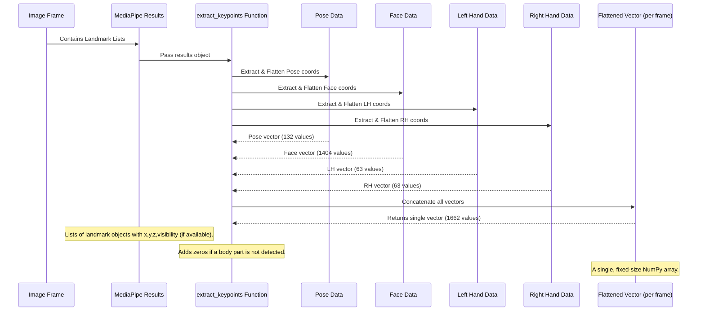

# 🧠 Chapter 2: Keypoint Extraction

## 🎯 What’s the Goal?

Turn MediaPipe’s rich body tracking data into a simple, fixed-size numerical vector (called a feature vector) per video frame. This prepares the data for machine learning

## ❓ What is Keypoint Extraction?

Keypoint Extraction takes complex MediaPipe outputs (landmark coordinates) and converts them into a single, flat vector per frame.

Steps:

- Extract landmarks from pose, face, and hands.
- Flatten their (x, y, z) coordinates (plus visibility for pose).
- Fill in missing data with zeros to keep size consistent.
- Return a single numerical array — the feature vector

## 🔢 Why Do We Need a Flat List of Numbers?

Machine learning models require:

- **Consistent input shape** across all frames.

- **Simple numeric data,** not images or nested structures.

A fixed-length vector allows us to train models that learn pose changes over time

## 🛠️ How it Works in Our Project

Let's look at the core function in the project code responsible for this: `extract_keypoints`.

```python
import numpy as np
import mediapipe as mp # (Assuming mp is imported as in Chapter 1)

def extract_keypoints(results):
    # Get pose landmarks or zeros if not detected
    pose = np.array([[res.x, res.y, res.z, res.visibility] for res in results.pose_landmarks.landmark]).flatten() if results.pose_landmarks else np.zeros(33*4)

    # Get face landmarks or zeros if not detected
    face = np.array([[res.x, res.y, res.z] for res in results.face_landmarks.landmark]).flatten() if results.face_landmarks else np.zeros(468*3)

    # Get left hand landmarks or zeros if not detected
    lh = np.array([[res.x, res.y, res.z] for res in results.left_hand_landmarks.landmark]).flatten() if results.left_hand_landmarks else np.zeros(21*3)

    # Get right hand landmarks or zeros if not detected
    rh = np.array([[res.x, res.y, res.z] for res in results.right_hand_landmarks.landmark]).flatten() if results.right_hand_landmarks else np.zeros(21*3)

    # Combine all landmarks into a single NumPy array
    return np.concatenate([pose, face, lh, rh])
```

Let's break down what's happening line by line (focusing on one part, like `pose`, as they all follow the same pattern):

1.  `pose = ... if results.pose_landmarks else np.zeros(33*4)`: 
      - If pose landmarks are detected: extract them
      - If not: fill with 132 zeros (33 landmarks × 4 values)

2.  `np.array([[res.x, res.y, res.z, res.visibility] for res in results.pose_landmarks.landmark])`:  For each pose landmark, get [x, y, z, visibility]

3.  `.flatten()`: Converts 2D list into 1D: [x1, y1, z1, v1, x2, y2, z2, v2, ...]
4.  `  Repeat for other parts`

        - Face: 468 × 3 = 1404 values (no visibility)
        - Left hand: 21 × 3 = 63 values
        - Right hand: 21 × 3 = 63 values

5.  `return np.concatenate([pose, face, lh, rh])`: Final output = 1662-length NumPy array

Let's quickly check the size:

```python
# Based on the previous description and code
pose_size = 33 * 4  # x, y, z, visibility
face_size = 468 * 3 # x, y, z
hand_size = 21 * 3  # x, y, z (for one hand)

total_size = pose_size + face_size + (hand_size * 2)
print(f"Total keypoint values per frame: {total_size}")
```

```
Total keypoint values per frame: 1662
```

So, for every single frame of video, our `extract_keypoints` function produces a NumPy array of 1662 numbers. This is the **feature vector** for that frame.

## 🔁 A Visual Flow of Keypoint Extraction

Here's a simple diagram showing the data flow:



This process takes the potentially complex and partially available data from MediaPipe and transforms it into the uniform, numerical input that our machine learning model expects.

## 💾 Data Collection and Saving

In the data collection phase of the project (see `Local_Data_Collection.ipynb`), this `extract_keypoints` function is used inside a loop that captures frames from the webcam. For each frame, the function is called, and the resulting 1662-number NumPy array is saved as a `.npy` file.

The files are organized into folders based on the action (e.g., `hello`, `thanks`) and then by sequence number (each sequence is one example video of you performing the sign).

```
MP_Data/
├── hello/
│   ├── 0/
│   │   ├── 0.npy  (keypoints for frame 0 of sequence 0)
│   │   ├── 1.npy  (keypoints for frame 1 of sequence 0)
│   │   ...
│   │   └── 29.npy (keypoints for frame 29 of sequence 0)
│   ├── 1/
│   │   ├── 0.npy
│   │   ...
│   │   └── 29.npy
│   ... (30 sequences for 'hello')
├── thanks/
│   ... (30 sequences for 'thanks')
└── iloveyou/
    ... (30 sequences for 'iloveyou')
```

This data structure means that for each action we want to recognize, we have multiple sequences (or video examples), and for each sequence, we have a fixed number of frames (30 in this project), each represented by its 1662-value keypoint vector.

## 📊 Summary Table

| Body Part    | # Landmarks | Values per Landmark | Total Values per Part | Zeros Size (if not detected) |
| :----------- | :---------- | :------------------ | :-------------------- | :--------------------------- |
| **Pose**     | 33          | x, y, z, visibility | 132                   | 132                          |
| **Face**     | 468         | x, y, z             | 1404                  | 1404                         |
| **Left Hand**| 21          | x, y, z             | 63                    | 63                           |
| **Right Hand**| 21          | x, y, z             | 63                    | 63                           |
| **Total**    |             |                     | **1662**              |                              |

This table clearly shows how we arrive at the 1662 features extracted per frame. This standardized numerical format is the direct input required by the subsequent steps in our machine learning pipeline.

## 🧩 Conclusion

Keypoint Extraction transforms MediaPipe outputs into clean, fixed-size feature vectors. This step is essential to prepare data for sequence modeling and sign recognition.

In the next chapter, we’ll look at how to combine these per-frame vectors into sequences for training.


[Sequence Handling](chapter3.md)

---
