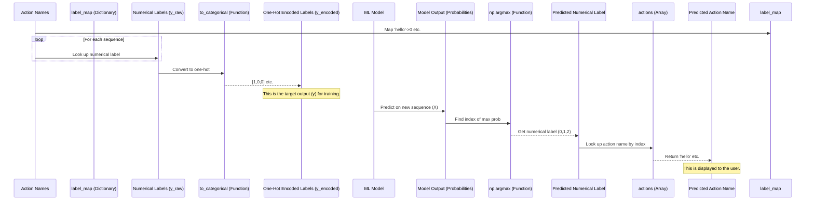
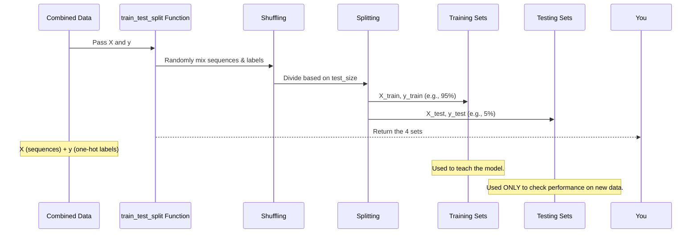

#  🔢 Chapter 4:  Label Mapping , Encoding and Data Splitting ✂️

In Chapter 3, we structured our video frame data into fixed-length sequences. Now, we need to tell the model what each sequence represents — e.g., 'hello' or 'thanks'. But models don’t understand text — they need numbers.

With X (input sequences) and y (one-hot labels) ready, we need to split the data into training and testing sets to avoid overfitting.

## Why Encode Labels?

We must convert action names like 'hello' into:

This process involves two main steps:

1.  **Label Mapping:** Assigning a unique number to each action name (e.g., 'hello' -> 0, 'thanks' -> 1, 'iloveyou' -> 2).

2.  **Label Encoding:** Converting these single numerical labels into a format that's standard and efficient for training classification models, specifically **One-Hot Encoding**..

## 🗺️ Step 1: Label Mapping

Create a mapping from action names to numbers:

```python
import numpy as np

# Actions to detect - defined in previous chapters
actions = np.array(['hello', 'thanks', 'iloveyou'])
label_map = {label: num for num, label in enumerate(actions)}
```

✅ Output:
```python
{'hello': 0, 'thanks': 1, 'iloveyou': 2}
```

Now, whenever we encounter the action name 'hello', we know its numerical label is 0, 'thanks' is 1, and 'iloveyou' is 2.

Add these labels to your dataset while loading sequences:

```python
labels.append(label_map[action])
```

After loading all the data, the `labels` list will contain a sequence of these numerical labels, one for each collected sequence of keypoints. For instance, if you collected 30 sequences for 'hello', 30 for 'thanks', and 30 for 'iloveyou', your `labels` list might look like `[0, 0, ..., 0, 1, 1, ..., 1, 2, 2, ..., 2]`.

We then convert this list into a NumPy array:

```python
# After the loading loop...
y = np.array(labels)
print(y.shape)
```

```
(90,)
```

This `y` array has a shape of `(90,)`, meaning it's a 1D array containing 90 single numbers (0, 1, or 2), one for each of the 90 sequences we loaded.

## 🔥 Step 2: Label Encoding (One-Hot Encoding) 

Convert numeric labels to one-hot vectors for training:
```python
from tensorflow.keras.utils import to_categorical
y = to_categorical(labels).astype(int)
print(y.shape)  # (90, 3)
```

*   Label 0 ('hello') becomes the vector `[1, 0, 0]`
*   Label 1 ('thanks') becomes the vector `[0, 1, 0]`
*   Label 2 ('iloveyou') becomes the vector `[0, 0, 1]`

The length of the one-hot vector is equal to the total number of classes (3 in our case).
| Action       | Label | One-Hot     |
| ------------ | ----- | ----------- |
| `'hello'`    | 0     | `[1, 0, 0]` |
| `'thanks'`   | 1     | `[0, 1, 0]` |
| `'iloveyou'` | 2     | `[0, 0, 1]` |


## Mapping Back: Decoding Predictions

During inference, the model outputs something like:

```python
res = [0.05, 0.90, 0.05]
predicted_label = np.argmax(res)       # 1
predicted_action = actions[predicted_label]  # 'thanks'
```

For example, if the model outputs `[0.05, 0.90, 0.05]`:
1.  The highest probability (0.90) is at index 1.
2.  The numerical label is 1.
3.  Looking at our `actions` array (`['hello', 'thanks', 'iloveyou']`), the element at index `1` is `'thanks'`. So, the prediction is `'thanks'`.


## 📊 Visualizing the Data Flow

Here's how the label mapping and encoding fit into our overall data preparation pipeline, along with the prediction decoding step:



## Why Split Our Data?

1. **Training set** = data the model learns from

2. **Testing set** = unseen data to evaluate performance

Ensures the model generalizes well to new gestures


## 🧪 How Do We Split the Data?

Use train_test_split from scikit-learn:

```python
from sklearn.model_selection import train_test_split
# Assuming X and y (one-hot encoded labels) are already loaded

# Split the data into training and testing sets
X_train, X_test, y_train, y_test = train_test_split(X, y, test_size=0.05, random_state=123)
```

Let's break this down:

1. test_size=0.05: 5% of data for testing
2. random_state: ensures reproducibility`

```python
# After the train_test_split call...
print(X_train.shape, y_train.shape, X_test.shape, y_test.shape)
```

```
((85, 30, 1662), (85, 3), (5, 30, 1662), (5, 3))
```

This output shows:

*   `X_train`: Contains 85 sequences, each 30 frames long, with 1662 keypoints per frame.
*   `y_train`: Contains 85 corresponding one-hot encoded labels, each of size 3.
*   `X_test`: Contains 5 sequences (5% of 90, rounded), with the same sequence and keypoint dimensions.
*   `y_test`: Contains 5 corresponding one-hot encoded labels.

| Set   | X Shape        | y Shape | Purpose          |
| ----- | -------------- | ------- | ---------------- |
| Train | (85, 30, 1662) | (85, 3) | Model training   |
| Test  | (5, 30, 1662)  | (5, 3)  | Model evaluation |


Now we have our data neatly divided into the sets needed for training and evaluating our model.

## 📊 Visualizing the Split

Here's a simple diagram showing what happens during the data splitting process:



## Summary of the Split

Based on our example with 90 sequences and a `test_size` of 0.05:

| Set Type     | Purpose                        | Data (X) Shape    | Labels (y) Shape | Number of Sequences |
| :----------- | :----------------------------- | :---------------- | :--------------- | :------------------ |
| **Training** | Used to train the model        | (85, 30, 1662)    | (85, 3)          | 85                  |
| **Testing**  | Used to evaluate the trained model | (5, 30, 1662)     | (5, 3)           | 5                   |
| **Total**    |                                | (90, 30, 1662)    | (90, 3)          | 90                  |

This division is fundamental to building a robust machine learning model that doesn't just memorize, but genuinely learns the underlying patterns of the hand signs.

## ✅ Summary

We've now:

Mapped and encoded our labels ✅

Split our dataset for training and evaluation ✅

Next up, we’ll use this data to train a powerful neural network — the LSTM model!

[LSTM Model](chapter5.md)

---
