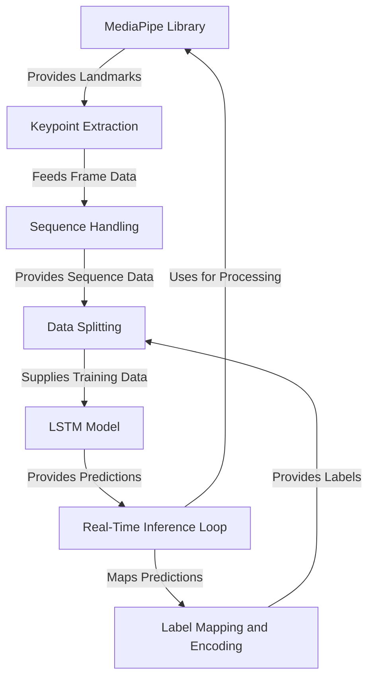

## 📘 Tutorial : Real Time Hand Sign Interpretation using LSTM

This repository includes a step-by-step guide for building and understanding the system:

## Visual Overwiew

## 💡 Features

- **Real-time detection** using webcam feed
- **MediaPipe** for precise hand landmark tracking
- **LSTM-based** classification on sequential landmark data
- Supports typical sign language gestures like “hello,” “thank you,” etc.
- Easy to extend: train new gestures by adding labeled sequences

## 🧪 Results

- **hello** → ✅
- **thanks** → ✅
- **iloveyou** → ✅
- Additional gestures: _you, yes, no, please, etc

Accuracy on test set: **~98%**  

- [Chapter 1: MediaPipe Library](docs/chapter1.md)
- [Chapter 2: Keypoint Extraction](docs/chapter2.md)
- [Chapter 3: Sequence Handling](docs/chapter3.md)
- [Chapter 4: Label Mapping , Encoding and Splitting](docs/chapter4.md)
- [Chapter 5: LSTM Model](docs/chapter5.md)
- [Chapter 6: Real-Time Inference](docs/chapter6.md)

